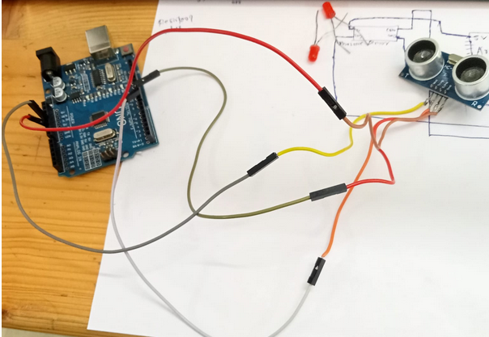

# ultrasonic-distance-led
Arduino + HC-SR04 distance-based LED feedback system
---

## 📸 Project Media

### 🔌 Circuit Schematic
This schematic was designed using **EasyEDA** and shows the complete connection setup of the ultrasonic sensor (HC-SR04) with the Arduino UNO and two LEDs. It includes pin mappings, power rails, and resistor values.

### 📷 Real-World Project Setup
This photo shows the actual working model of the distance-based LED system. The project was built without a breadboard by connecting components directly using jumper wires. 

LEDs respond dynamically based on the measured distance from the ultrasonic sensor.

### 🗒️ Additional Notes
- `distance_mapping.txt`: Contains range definitions and LED logic explanation.
- Distance-to-LED Mapping Logic:

- 0 to 5 cm:
    → Built-in LED (Pin 13) is ON
    → External LEDs OFF
    → Indicates object is extremely close

- 5 to 10 cm:
    → External LED1 (Pin 2) is ON
    → Other LEDs OFF
    → Indicates object is at a moderate distance

- 10 to 15 cm:
    → Built-in LED + LED1 + LED2 (Pins 13, 2, 3) all BLINK
    → Indicates caution zone (object approaching)
    → LEDs toggle ON and OFF every 200ms

- Greater than 15 cm:
    → All LEDs OFF
    → No nearby object detected

- `wiring_guide.txt`: Describes the physical wiring setup in case someone wants to replicate it.
- Wiring Guide – Ultrasonic LED Project

Microcontroller: Arduino UNO

Sensor: HC-SR04 Ultrasonic Sensor
- VCC  → 5V on Arduino
- GND  → GND on Arduino
- TRIG → D9 on Arduino
- ECHO → D10 on Arduino

LED1 (External)
- Anode (+) → 220Ω resistor → D2 on Arduino
- Cathode (–) → GND

LED2 (External)
- Anode (+) → 220Ω resistor → D3 on Arduino
- Cathode (–) → GND

Built-in LED:
- Controlled via Pin 13 (already wired inside the UNO)

Power:
- Arduino powered via USB cable

No breadboard used. Connections made directly using jumper wires.
Project assembled on a flat surface with proper insulation to avoid shorts.

